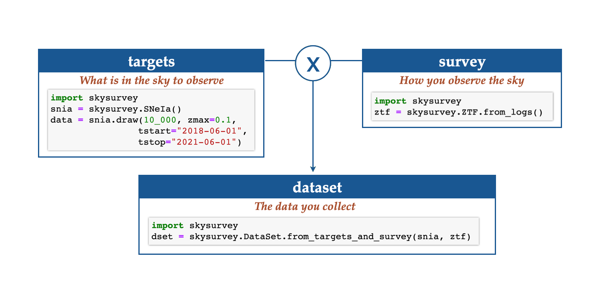
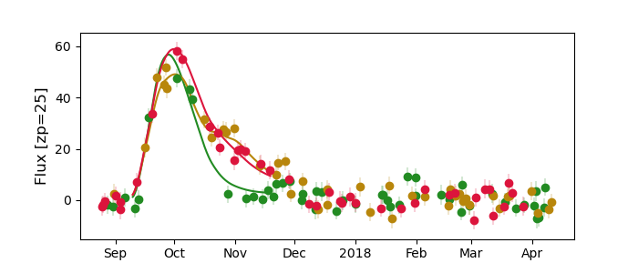

========================
skysurvey
========================

skysurvey_ is a python package made to simulate astronomical targets as they
would be observed by a survey.

To simulate a realistic lightcurves you need two things:

1.  **target** properties as given by nature.
2. **survey** observing data providing what has been observed when
   and under which condition.

Joining these to create:

3. a **dataset**, i.e. simulated data of the targets observed by your survey.

Elements
======
	   
.. grid:: 3
   :margin: 0
   :padding: 0
   :gutter: 0

   .. grid-item-card:: Targets
      :columns: 12 6 6 4
      :class-card: sd-border-0
      :shadow: None

      ``Target`` are objects as given by natures. You can generate
      realistic targets, building complex parametrisation thanks to
      the modeldag_ backend.
      skysurvey_ provides multi-predefined targets, such as SNeIa, SNII,
      or any sncosmo_ TimeSerie Source. 

   .. grid-item-card:: Survey
      :columns: 12 6 6 4
      :class-card: sd-border-0
      :shadow: None

      Survey objects handle your observations. It can
      match sky positions with observing logs and provide observing
      statistics.  There are two kinds of
      surveys: ``Survey`` that accept any observing pattern and
      ``GridSurvey`` that are customed for field-based surveys.

   .. grid-item-card:: DataSet
      :columns: 12 6 6 4
      :class-card: sd-border-0
      :shadow: None

      ``DataSet`` corresponds the actual data you would have collected
      observing ``target`` (s) with your ``survey``. A dataset is easy
      and fast to load, and it contains analytical and visualisation tools.

.. grid:: 3

    .. grid-item-card:: :material-regular:`star;2em` Make Targets
      :columns: 12 6 6 4
      :link: quickstart/quickstart_target.html

    .. grid-item-card:: :material-regular:`scatter_plot;2em` Build a Survey
      :columns: 12 6 6 4
      :link: quickstart/quickstart_survey.html

    .. grid-item-card:: :material-regular:`timeline;2em`
			Create a DataSet
      :columns: 12 6 6 4
      :link: quickstart/quickstart_survey_target_dataset.html

		   

	   

Sharp start
============

You need to create a `Transient` object, a `Survey`
object and then to simulate how your survey would observe
your targets. This latter is called a `DataSet`.

Step 1: transients
------------------

**Draw the 'truth'**

.. tab-set::

    .. tab-item:: SNeIa

       .. code-block:: python

	  import skysurvey
	  snia = skysurvey.SNeIa()
	  data = snia.draw(size=50_000)
	  data.head(5) # see also self.data

    .. tab-item:: SNeII

       .. code-block:: python

	  import skysurvey
	  snii = skysurvey.SNII()
	  data = snii.draw(size=50_000)
	  data.head(5) # see also self.data

    .. tab-item:: Any TimeSerie

       .. code-block:: python

	  import skysurvey
	  snib = skysurvey.TSTransient("v19-2005bf-corr")
	  # see https://sncosmo.readthedocs.io/en/stable/source-list.html
	  snib.draw(50_000)
	  snib.data.head(5) # also self.data

You have more built-in targets. You can also directly use ``target = Target.from_draw()``.

Step 2: survey
-----------------

**provide what has been observed when**

.. tab-set::

    .. tab-item:: Survey

       .. code-block:: python

            import skysurvey
	  
            # footprint
            from shapely import geometry
            footprint = geometry.Point(0,0).buffer(2)

            # observing logs
            import numpy as np
            from skysurvey.tools import utils
            size = 10_000

            data = {}
            data["gain"] = 1
            data["zp"] = 30
            data["skynoise"] = np.random.normal(size=size, loc=200, scale=20)
            data["mjd"] = np.random.uniform(56_000, 56_200, size=size)
            data["band"] = np.random.choice(["desg","desr","desi"], size=size)

            data["ra"], data["dec"] = utils.random_radec(size=size, 
                                                         ra_range=[200,250], 
                                                         dec_range=[-20,10])

            # Load a GridSurvey
            survey = skysurvey.Survey.from_pointings(data, footprint=footprint)
	    
    .. tab-item:: GridSurvey

       .. code-block:: python

            import skysurvey
	    
            # footprint
            from shapely import geometry
            footprint = geometry.Point(0,0).buffer(2)

            # fields
            import numpy as np
            radec = {'C1': {'dec': -27.11161, 'ra': 54.274292+180},
                     'C2': {'dec': -29.08839, 'ra': 54.274292+180},
                     'C3': {'dec': -28.10000, 'ra': 52.648417+180}
                     }

            # observing logs
            size = 10_000

            data = {}
            data["gain"] = 1
            data["zp"] = 30
            data["skynoise"] = np.random.normal(size=size, loc=200, scale=20)
            data["mjd"] = np.random.uniform(56_000, 56_200, size=size)
            data["band"] = np.random.choice(["desg","desr","desi"], size=size)

            data["fieldid"] = np.random.choice(list(radec.keys()), size=size)

            # Load a GridSurvey
            survey = skysurvey.GridSurvey.from_pointings(data, radec,
	                                       	         footprint=footprint)

    .. tab-item:: ZTF

       .. code-block:: python
		       
            import skysurvey
	    
            survey = skysurvey.ZTF.from_logs() # need password.
		       
``Survey`` is uses healpy_ as backend to match position with observing
history, while ``GridSurvey`` uses shapely_ and geopandas_. Yet, both
can be used equally in any skysurvey_ input ;
especially for DataSet.

You have several surveys already implemented, such as ``ZTF`` and ``DES``
(shallow and deep fields).

Step 3: dataset 
------------------

**and get lightcurve data**

as you would observe them i.e., the dataset. The simulated lightcurves are in
dset.data, the input survey is stored in dset.survey, the input
targets is stored in dset.targets. 

.. tab-set::

    .. tab-item:: Realistic

       .. code-block:: python
		       
            import skysurvey
            dset = skysurvey.DataSet.from_targets_and_survey(snia, survey)
            dset.data

    .. tab-item:: Noise-free

       .. code-block:: python
		       
            import skysurvey
            dset = skysurvey.DataSet.from_targets_and_survey(snia, survey,
                                                             incl_error=False)
            dset.data
	    

    .. tab-item:: Multi-targets

       .. code-block:: python
		       
            import skysurvey
	    targets = skysurvey.TargetCollection([snia, snii])
            dset = skysurvey.DataSet.from_targets_and_survey(targets, survey)
            dset.data
	    

Tutorials
======

.. toctree::
   :maxdepth: 2
   :caption: How to

   installation
   quickstart/index
   howto/index   
   advanced/index
   
.. toctree::
   :maxdepth: 2
   :caption: API documentation

   skysurvey
   
   

.. _simsurvey: https://simsurvey.readthedocs.io/en/latest/index.html
.. _skysurvey: https://github.com/MickaelRigault/skysurvey
.. _modeldag: https://github.com/MickaelRigault/modeldag
.. _sncosmo: https://sncosmo.readthedocs.io/en/stable/
.. _`see list here`: https://sncosmo.readthedocs.io/en/stable/source-list.html
.. _snana: https://github.com/RickKessler/SNANA
.. _shapely: https://shapely.readthedocs.io/en/stable/manual.html
.. _geopandas: https://geopandas.org/en/stable/gallery/index.html
.. _healpy: https://healpy.readthedocs.io/en/latest/
