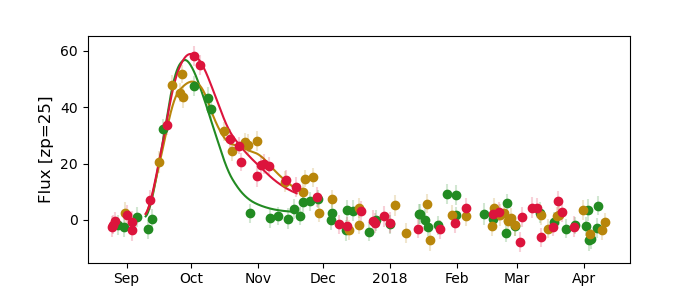

skysurvey: simulate what your survey sees
=========================================

**skysurvey** is a Python package to simulate astronomical targets (supernovae,
kilonovae, any transient) as they would be observed by a real or imagined
survey. It produces realistic, noisy lightcurves in seconds, for millions of
targets.

.. grid:: 1 2 3 3
   :gutter: 3
   :margin: 4 4 0 0

   .. grid-item-card:: :octicon:`star;1.5em;sd-mr-1` Realistic targets
      :class-card: sd-border-0
      :shadow: none

      Draw populations of SNe Ia, core-collapse SNe, kilonovae or any
      ``sncosmo`` source at the right rate, with parameter models you can
      fully customise.

   .. grid-item-card:: :octicon:`telescope;1.5em;sd-mr-1` Any survey
      :class-card: sd-border-0
      :shadow: none

      Use real observing logs (ZTF, LSST, DES, SNLS) or build your own from
      a list of pointings, with field-based or free-form strategies.

   .. grid-item-card:: :octicon:`zap;1.5em;sd-mr-1` Fast datasets
      :class-card: sd-border-0
      :shadow: none

      Combine both to get the lightcurves you would have collected, ready
      for detection studies, lightcurve fits or cosmology.

Installation
------------

.. code-block:: bash

   pip install skysurvey

See :doc:`installation` for optional dependencies and the development
version.

skysurvey in three steps
------------------------

Every simulation follows the same pattern: create a **target** (the truth), a
**survey** (the observations), and combine them into a **dataset** (the data).
See :doc:`key_concepts` for details.

**1. Draw the truth.**

.. tab-set::

   .. tab-item:: SNe Ia

      .. code-block:: python

         import skysurvey

         snia = skysurvey.SNeIa.from_draw(tstart=56_000, tstop=56_100, zmax=0.2)
         snia.data.head()

   .. tab-item:: SNe II

      .. code-block:: python

         import skysurvey

         snii = skysurvey.SNeII.from_draw(tstart=56_000, tstop=56_100, zmax=0.1)
         snii.data.head()

   .. tab-item:: Any sncosmo source

      .. code-block:: python

         import skysurvey

         # any sncosmo template (https://sncosmo.readthedocs.io/en/stable/source-list.html)
         # with a Gaussian absolute magnitude distribution (mean, scatter)
         snib = skysurvey.TSTransient("v19-2005bf-corr", magabs=[-18, 1])
         # no rate given: set the number of targets with size
         snib.draw(size=5_000, tstart=56_000, tstop=56_100, zmax=0.1, inplace=True)
         snib.data.head()

**2. Describe what has been observed, and when.**

.. tab-set::

   .. tab-item:: Survey

      .. code-block:: python

         import numpy as np
         from shapely import geometry
         from skysurvey.tools import utils

         # camera footprint (a 2 deg radius disk) and observing logs
         footprint = geometry.Point(0, 0).buffer(2)

         size = 10_000
         data = {"gain": 1, "zp": 30,
                 "skynoise": np.random.normal(size=size, loc=200, scale=20),
                 "mjd": np.random.uniform(56_000, 56_100, size=size),
                 "band": np.random.choice(["desg", "desr", "desi"], size=size)}
         data["ra"], data["dec"] = utils.random_radec(size=size,
                                                      ra_range=[200, 250],
                                                      dec_range=[-20, 10])

         survey = skysurvey.Survey.from_pointings(data, footprint=footprint)

   .. tab-item:: GridSurvey

      .. code-block:: python

         import numpy as np
         from shapely import geometry

         # camera footprint and field centers
         footprint = geometry.Point(0, 0).buffer(2)
         radec = {"C1": {"ra": 234.27, "dec": -27.11},
                  "C2": {"ra": 234.27, "dec": -29.09},
                  "C3": {"ra": 232.65, "dec": -28.10}}

         size = 10_000
         data = {"gain": 1, "zp": 30,
                 "skynoise": np.random.normal(size=size, loc=200, scale=20),
                 "mjd": np.random.uniform(56_000, 56_100, size=size),
                 "band": np.random.choice(["desg", "desr", "desi"], size=size),
                 "fieldid": np.random.choice(list(radec), size=size)}

         survey = skysurvey.GridSurvey.from_pointings(data, radec, footprint=footprint)

   .. tab-item:: ZTF

      .. code-block:: python

         # requires the ztfcosmo package
         survey = skysurvey.ZTF.from_logs()

   .. tab-item:: LSST

      .. code-block:: python

         # path to an LSST opsim simulation (large file: loading takes a while)
         survey = skysurvey.LSST.from_opsim("baseline_v3.3_10yrs.db")

**3. Get the lightcurves you would have observed.**

.. tab-set::

   .. tab-item:: Realistic

      .. code-block:: python

         dset = skysurvey.DataSet.from_targets_and_survey(snia, survey)
         dset.data.head()
         dset.show_target_lightcurve()

   .. tab-item:: Noise-free

      .. code-block:: python

         dset = skysurvey.DataSet.from_targets_and_survey(snia, survey,
                                                          incl_error=False)

   .. tab-item:: Several targets

      .. code-block:: python

         # pass a list of targets
         dset = skysurvey.DataSet.from_targets_and_survey([snia, snii], survey)

Where to go next
----------------

.. grid:: 1 2 2 3
   :gutter: 3

   .. grid-item-card:: :octicon:`rocket;1.5em;sd-mr-1` Quickstart
      :link: quickstart/skysurvey_101
      :link-type: doc

      An end-to-end simulation in five minutes.

   .. grid-item-card:: :octicon:`mortar-board;1.5em;sd-mr-1` Tutorials
      :link: quickstart/index
      :link-type: doc

      Learn targets, surveys and datasets step by step.

   .. grid-item-card:: :octicon:`checklist;1.5em;sd-mr-1` How-to guides
      :link: howto/index
      :link-type: doc

      Short recipes for common tasks.

   .. grid-item-card:: :octicon:`beaker;1.5em;sd-mr-1` Examples
      :link: examples/index
      :link-type: doc

      Science use cases: detection efficiency, survey design, Hubble
      diagram.

   .. grid-item-card:: :octicon:`list-unordered;1.5em;sd-mr-1` Transient catalogue
      :link: transientclasses/index
      :link-type: doc

      The built-in transient models and their parameters.

   .. grid-item-card:: :octicon:`code;1.5em;sd-mr-1` API reference
      :link: api/index
      :link-type: doc

      Every class and function, organised by concept.

.. toctree::
   :hidden:
   :maxdepth: 1
   :caption: Getting started

   installation
   quickstart/skysurvey_101
   key_concepts

.. toctree::
   :hidden:
   :maxdepth: 2
   :caption: Learn

   quickstart/index
   howto/index
   examples/index

.. toctree::
   :hidden:
   :maxdepth: 2
   :caption: Reference

   transientclasses/index
   advanced/index
   api/index
