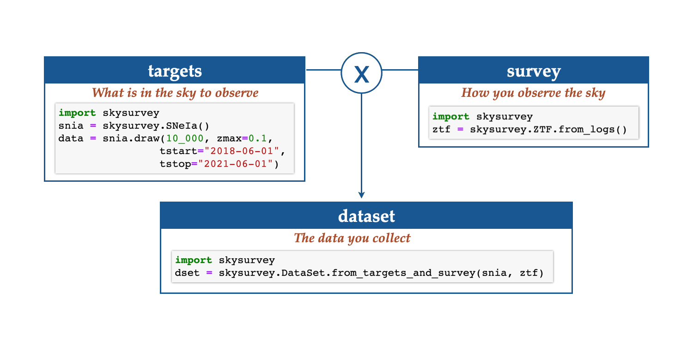

Key concepts
============

skysurvey simulates what a survey would observe of a population of
astrophysical objects. It is built on three objects, and you will use them in
almost every script:

.. grid:: 1 1 3 3
   :gutter: 2

   .. grid-item-card:: :octicon:`star` Target
      :text-align: center

      What **nature** provides.

   .. grid-item-card:: :octicon:`telescope` Survey
      :text-align: center

      What **you observed**, when and how.

   .. grid-item-card:: :octicon:`graph` DataSet
      :text-align: center

      **Target** observed by the **Survey**.

Target: the truth
-----------------

A :class:`~skysurvey.Target` (or :class:`~skysurvey.Transient` for objects
with a time evolution) is defined by three ingredients:

**Template**
   The spectral time series of the object (an ``sncosmo`` source such as
   ``"salt2"`` for SNe Ia or ``"v19-2005bf-corr"`` for a SN Ib). It turns
   target parameters into fluxes in any band. See :doc:`api/templates`.

**Model**
   How the target parameters are drawn. A model is a dictionary in which each
   entry gives the function that draws a parameter and its arguments. Entries
   can depend on each other with the ``"@name"`` syntax: for SNe Ia, the
   observed magnitude depends on the stretch ``x1``, the color ``c`` and the
   redshift ``z``. Under the hood, the model is a directed acyclic graph handled by
   `modeldag <https://github.com/MickaelRigault/modeldag>`_. See
   :doc:`advanced/build_a_new_model`.

**Rate**
   How many objects occur per unit volume and time, in
   :math:`\mathrm{Gpc^{-3}\,yr^{-1}}`. It can be a number or a function of
   redshift. Given a sky area and a time range, the rate sets how many targets
   are drawn and their redshift distribution. See :doc:`howto/change_rate`.

Drawing a target creates its ``data``, a :class:`pandas.DataFrame` with one row
per object:

.. code-block:: python

   import skysurvey
   snia = skysurvey.SNeIa.from_draw(tstart=58_900, tstop=58_930, zmax=0.1)
   snia.data.columns # z, x1, c, t0, ra, dec, magabs, magobs, template

skysurvey ships many targets: :class:`~skysurvey.SNeIa`, core-collapse
supernovae (:class:`~skysurvey.SNeII`, :class:`~skysurvey.SNeIb`, ...),
:class:`~skysurvey.Kilonova`, and :class:`~skysurvey.TSTransient` for any
``sncosmo`` source. See :doc:`transientclasses/index`.

Survey: the observations
------------------------

A :class:`~skysurvey.Survey` stores the observing logs, with one row per
exposure. The required columns are:

=============  ===========================================================
``mjd``        Time of the observation (Modified Julian Date).
``band``       Name of the bandpass (any band known to ``sncosmo``).
``skynoise``   Background noise in flux units (same zero point as ``zp``).
``gain``       Gain of the detector (electrons per ADU).
``zp``         Zero point of the exposure.
=============  ===========================================================

Each exposure also carries a pointing (``ra``, ``dec``) or a field identifier
(``fieldid``), and the survey knows the camera footprint. This lets it tell
which exposures observed which part of the sky. There are two flavours:

- :class:`~skysurvey.Survey` accepts any observing pattern and matches sky
  positions with HEALPix.
- :class:`~skysurvey.GridSurvey` is optimised for surveys observing a fixed
  set of fields; it uses shapely and geopandas.

Ready-to-use surveys exist for :class:`~skysurvey.ZTF`,
:class:`~skysurvey.LSST`, :class:`~skysurvey.DES` and
:class:`~skysurvey.SNLS`. See :doc:`api/surveys`.

DataSet: the simulated data
---------------------------

:meth:`DataSet.from_targets_and_survey <skysurvey.DataSet.from_targets_and_survey>`
matches each target with the exposures that observed it while it was active,
computes the expected flux from the template, and adds noise from the
observing conditions:

.. code-block:: python

   dset = skysurvey.DataSet.from_targets_and_survey(snia, survey)
   dset.data     # one row per (target, exposure): mjd, band, flux, fluxerr, ...
   dset.targets  # the input target
   dset.survey   # the input survey

The :class:`~skysurvey.DataSet` then provides tools to analyse the data, such
as the number of detections per target and plots of individual lightcurves
(see :doc:`api/dataset`). Fit the lightcurves with
:func:`skysurvey.lcfit.fit_salt` (see :doc:`examples/snia_hubble_diagram`).

Effects: altering the light
---------------------------

An :class:`~skysurvey.Effect` changes a target's template and adds the
corresponding parameters to its model. Examples are Milky Way extinction
(``skysurvey.effects.mw_extinction``), host dust (``skysurvey.effects.host_dust``)
and SN Ia color scatter models. Pass effects when you create a target
(``effect=``) or add them later with ``target.add_effect()``. See
:doc:`howto/add_mwebv`.

Reproducibility
---------------

Every function that draws random numbers takes ``rng`` (or ``seed``) and passes
it to :func:`numpy.random.default_rng`. Set it to get reproducible
simulations.
